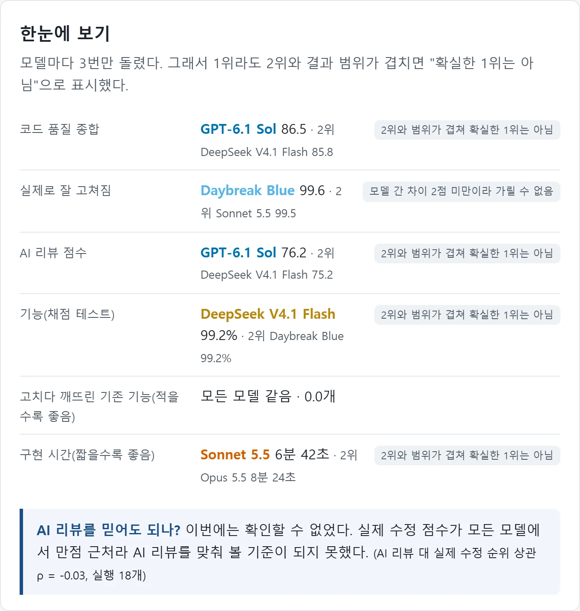
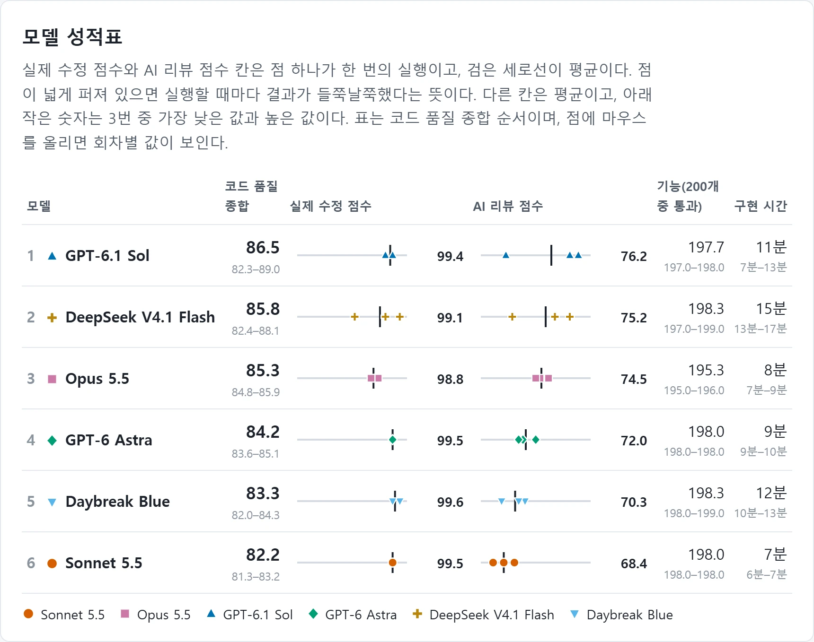
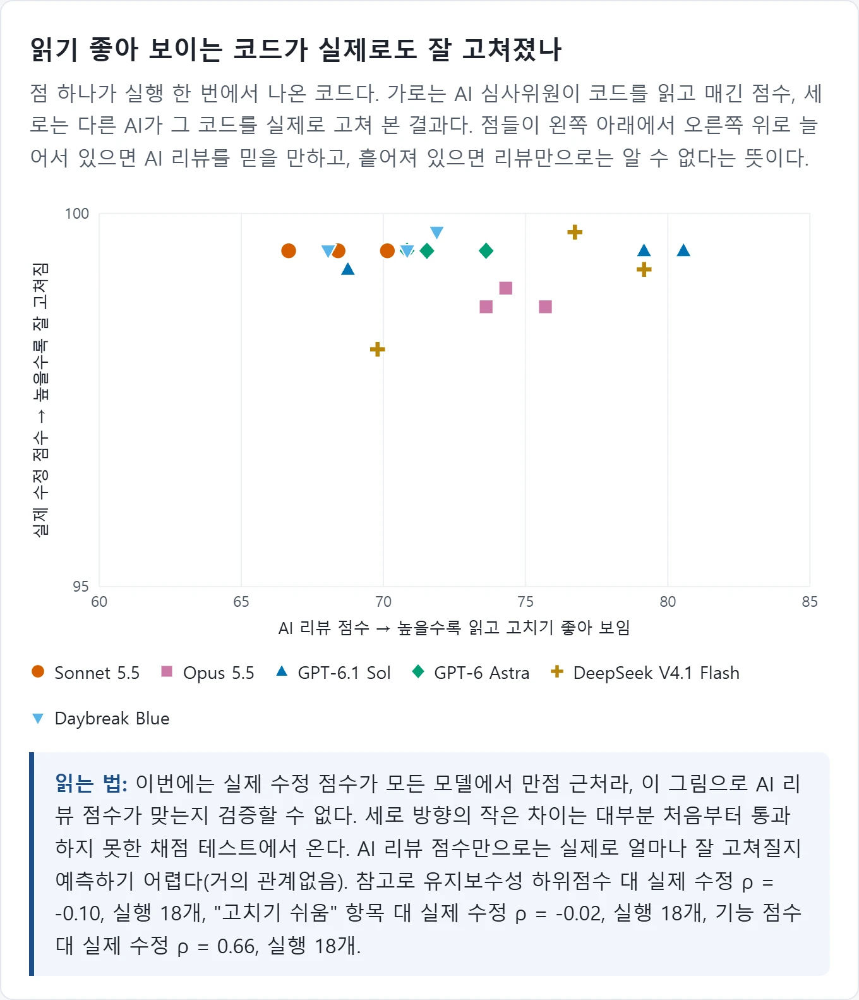
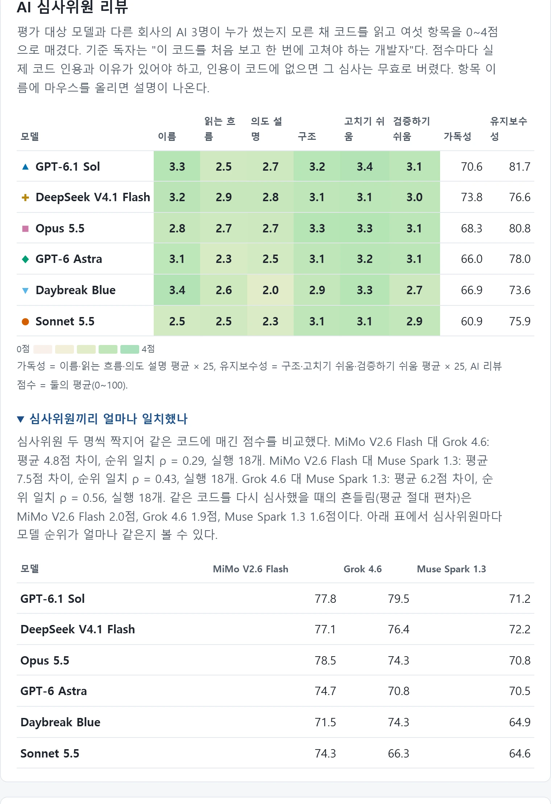

# Maker 코드 품질 평가 (2026-10)

코드를 짜는 하위 AI 작업자(Maker) 후보 6개를 같은 과제와 조건으로 실행했습니다. 나중에 고치기 쉬운 코드인지를 확인하기 위해 VulcanBench 코드 품질 방식으로 측정했습니다. 결과는 이 과제 하나 기준이며 일반화하지 않습니다.

## 한눈에 보기

- AI 리뷰는 위쪽 셋(Sol, DeepSeek, Opus)과 아래쪽 셋(Astra, Daybreak, Sonnet)으로 나뉩니다.
- 각 묶음 안에서는 회차 범위가 겹쳐 우열을 가릴 수 없습니다.
- 실제 수정 테스트는 전부 99점 근처에 몰려 모델 간 변별이 되지 않습니다.

## 용어

| 용어 | 뜻 |
| --- | --- |
| Maker | 실제로 코드를 작성하는 하위 AI 작업자 모델입니다. |
| AI 리뷰(L1) | 중립 심사위원 AI가 코드의 가독성과 유지보수성을 매긴 점수입니다. |
| 실제 수정(L3) | 요구사항 변경 티켓을 주고 후속 작업자가 코드를 고쳤을 때의 성공률 점수입니다. |
| 종합 | VulcanBench 비중을 따라 계산한 점수입니다. (15×L1 + 12×L3)/27 공식을 씁니다. |
| 회차 범위 | 3회 반복 실행 중 최저 점수와 최고 점수의 구간입니다. |
| ρ(순위 상관) | 두 지표 또는 평가자 간 순위가 얼마나 일치하는지 나타내는 상관계수입니다. |

## 측정 조건

- 과제: 스프레드시트 수식 엔진 구현 과제(기능 테스트 200개)를 사용했습니다.
- 실행 규모: 모델 6개를 각 3회씩 실행했습니다.
- 추론 강도: 모든 모델의 추론 강도를 high로 고정했습니다.
- 심사위원 구성: 평가 대상과 다른 회사 모델 3명(MiMo V2.6 Flash, Muse Spark 1.3, Grok 4.6)이 제출물마다 2회씩 심사해 총 108건을 판정했습니다.
- 심사 방식: 점수마다 실제 코드 인용을 필수로 첨부하게 했고 원문과 대조 검증했습니다. 심사위원에게는 외부 도구 없이 순수 코드만 전달했습니다.
- 실제 수정 과제: 대소문자 무시 비교, SUMIFS 및 COUNTIFS 추가의 2개 과제를 서로 다른 두 계열 작업자가 수행했습니다.
- 심사위원 보정: 일부러 압축한 코드를 대조군으로 심사시켰습니다. Gemini 3.8 Flash는 정상 코드를 만점 근처로 몰아 평가에서 제외했습니다.

## 결과

| 모델 | 종합 | AI 리뷰(회차 범위) | 실제 수정 | 기능(200개 중) | 구현 시간 |
| --- | --- | --- | --- | --- | --- |
| GPT-6.1 Sol | 86.5 | 76.2 (68.8~80.6) | 99.4 | 197.7 | 11분 |
| DeepSeek V4.1 Flash | 85.8 | 75.2 (69.8~79.2) | 99.1 | 198.3 | 15분 |
| Opus 5.5 | 85.3 | 74.5 (73.6~75.7) | 98.8 | 195.3 | 8분 |
| GPT-6 Astra | 84.2 | 72.0 (70.8~73.6) | 99.5 | 198.0 | 9분 |
| Daybreak Blue | 83.3 | 70.3 (68.1~71.9) | 99.6 | 198.3 | 12분 |
| Sonnet 5.5 | 82.2 | 68.4 (66.7~70.1) | 99.5 | 198.0 | 7분 |

*읽는 법: 점은 한 번 실행한 결과이고, 세로선은 평균값입니다.*

## AI 리뷰가 실제 수정을 예측하나

실제 수정 점수가 98.8점에서 99.6점 사이에 몰려 있습니다. 순위 상관계수는 ρ = -0.03으로 나왔습니다. 따라서 이번 자료만으로는 AI 리뷰 점수가 실제 수정 난이도를 예측하는지 검증할 수 없습니다. 다음 평가에는 더 큰 구조 변경을 요구하는 티켓이 필요합니다.

## 심사위원

모델 6개의 평균 순위 일치는 Muse–Grok 0.89, MiMo–Muse 0.71, MiMo–Grok 0.66으로 나타났습니다. 반면 실행 18개 단위 순위 일치는 Grok–Muse 0.56, MiMo–Muse 0.43, MiMo–Grok 0.29에 그쳐 개별 제출물 판정은 꽤 갈렸습니다. 재심사 흔들림(평균 절대 편차)은 Muse 1.6점, Grok 1.9점, MiMo 2.0점이었습니다. 심사위원 하나만 보면 순위가 바뀝니다. Daybreak의 경우 Grok 점수만 보면 74.7점이었으나, 심사위원 셋의 평균은 70.3점으로 내려갔습니다.

## 한계와 공정성

- 과제 1개와 모델당 3회 실행에 기반한 결과입니다.
- 실제 수정(L3) 평가에 천장 효과가 발생해 모델 간 변별력이 부족했습니다.
- Sonnet이 1위였던 VulcanBench 결과와 순위가 반대로 나타났으므로 일반화하면 안 됩니다.
- 심사 도중 사용 한도 초과로 심사위원을 평가 대상 모델로 자동 대체해 재전송한 사례가 있었습니다. 요청별 격리 검사가 해당 10건을 버리고 다시 돌렸으며, 최종 채택 결과에는 대체 건수가 0건입니다.
- Daybreak Blue는 비교용으로 함께 측정한 모델입니다.
